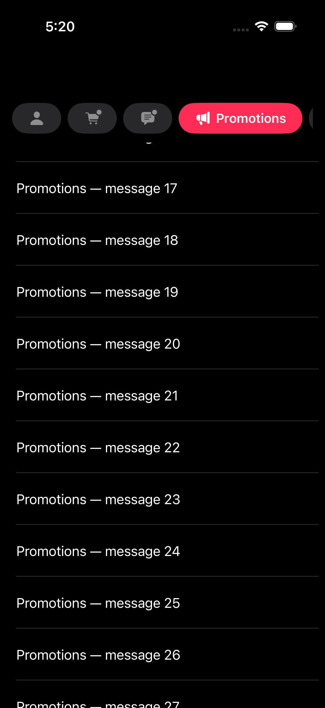

# TiPillTabs


Native, animated Mail-style pill tabs for Titanium iOS. Module ID: `ti.pilltabs`, version `1.0.0`. Written in Swift and UIKit; no SwiftUI hosting or third-party runtime dependency. Requires iOS 17+ and Titanium SDK 13.4.1.GA+ for this package.

## Install

Download the platform ZIP from [GitHub Releases](https://github.com/designbymind/TiPillTabs/releases).

Extract `ios/dist/ti.pilltabs-iphone-1.0.0.zip` into your app directory for an app-local installation, or into `~/Library/Application Support/Titanium` for a global installation. Add to `tiapp.xml`:

```xml
<modules>
    <module platform="iphone" version="1.0.0">ti.pilltabs</module>
</modules>
```

## Create a view

```javascript
var PillTabs = require('ti.pilltabs');
var tabs = PillTabs.createView({
    left: 15, right: 15, height: 38,
    items: [
        { id: 'primary', title: 'Primary', systemImage: 'person.fill',
          tintColor: '#8E8E93', backgroundColor: '#28282A',
          activeTintColor: '#FFFFFF', activeBackgroundColor: '#007AFF' },
        { id: 'updates', title: 'Updates', systemImage: 'text.bubble.fill',
          activeBackgroundColor: '#5856D6' },
        { id: 'all', title: 'All Mail', systemImage: 'tray.fill',
          activeTintColor: '#000000', activeBackgroundColor: '#FFFFFF' }
    ],
    selectedId: 'primary', aggregateId: 'all', gestureEnabled: true
});
tabs.addEventListener('change', function (e) {
    Ti.API.info(e.id + ' via ' + e.reason);
});
// Programmatic selection updates the native view and fires change once.
tabs.selectedId = 'updates';
```

Use an explicit height (38 matches the supplied demo; 44 or larger gives a larger touch target). Standard Titanium view positioning and sizing properties apply. The parent app owns the actual inbox/category content.

## Preview



## Properties

| Property | Default | Meaning |
| --- | --- | --- |
| `items` | `[]` | Array of item dictionaries. Replace the array to change titles, icons, or colors. |
| `selectedId` | First item ID, or `null` when empty | Read/write selected ID. Unknown IDs are ignored. Assign `null` to select the first item. |
| `aggregateId` | Last item ID | The All Mail equivalent. Set `''` to disable aggregate toggling. Unknown IDs disable it. |
| `gestureEnabled` | `false` | Enable horizontal swipe toggling on the tabs. |
| `toggleOnReselect` | `true` | Tapping the selected category selects the aggregate; tapping selected aggregate returns to the last category. |
| `spacing` | `8` | Gap between pills in points; reduced as needed on extremely narrow views. |
| `trailingVisibility` | `5` | Width of the aggregate pill's trailing-edge preview in category mode. Applies when aggregate is last, there are at least three items, and enough room. |
| `animated` | `true` | Animate selection changes. Reduce Motion disables these animations automatically. |
| `animationDuration` | `300` | Animation duration in milliseconds. Zero disables animation. |

Item dictionaries:

| Property | Required/default | Meaning |
| --- | --- | --- |
| `id` | Required, unique nonempty string | Stable identity, independent of the displayed title. |
| `title` | Required string | Selected title and accessibility label. |
| `systemImage` | Required string | SF Symbol name; unavailable symbols show a question mark. |
| `tintColor` | System secondary label color | Inactive icon tint. |
| `backgroundColor` | System tertiary fill color | Inactive pill background. |
| `activeTintColor` | White | Selected icon and title tint. |
| `activeBackgroundColor` | System blue | Selected pill background. |
| `badge` | `false` | Retained attention-dot state. The dot is shown only while this pill is inactive. |
| `badgeTintColor` | Inactive `tintColor` | Optional dot tint override. `null` restores the inactive tint. |

Colors accept Titanium color values. The system defaults adapt to light/dark appearance. Mutating `tabs.items[0]` alone does not notify native code: assign a new `items` array. Invalid arrays are rejected as a whole. Replacing items preserves a valid selection; removing the selected item falls back to the first remaining item and emits a change. Empty arrays clear the selection.

Swipe toward the leading edge selects the aggregate (leftward in left-to-right layouts); the reverse restores the last non-aggregate selection. Swipes act after release beyond 40 points and do not cycle through every category. The recognizer starts only for horizontal movement, allowing the enclosing TableView's vertical scroll recognizer to handle vertical drags.

## Attention dots

Set `badge: true` on an item to show its Mail-style dot at the symbol's upper-right corner. The dot defaults to the item's inactive `tintColor`; `badgeTintColor` overrides it. A small pill-colored outline separates the dot from the icon. Selecting a pill hides its dot without clearing its badge flag. It returns when the pill becomes inactive; clearing new-mail state is up to your app.

```javascript
tabs.showBadge('updates');
tabs.hideBadge('updates');
tabs.setBadge('transactions', true); // false removes the dot
tabs.setBadgeTintColor('updates', '#FF9500');
tabs.setBadgeTintColor('updates', null); // follow inactive tintColor again
```

These methods use stable item IDs and update `tabs.items` so a later copy/reassignment preserves their state. Unknown IDs are ignored. They do not change selection or fire `change`, and badge-only updates do not recreate pills, resize the header, or interrupt selection animations. You can also assign a new `items` array with updated `badge` / `badgeTintColor` properties. VoiceOver reports “Needs attention” for marked tabs, including a selected tab whose dot is visually hidden.

## Sticky TableViewSection header

```javascript
var header = Ti.UI.createView({ height: 60, backgroundColor: '#000000' });
header.add(tabs);
var section = Ti.UI.createTableViewSection({ headerView: header });
section.add(Ti.UI.createTableViewRow({ title: 'Message', height: 64 }));
var table = Ti.UI.createTableView({
    style: Ti.UI.iOS.TableViewStyle.PLAIN,
    sectionHeaderTopPadding: 0,
    data: [section]
});
```

Use the **section's** `headerView`. In a plain TableView it floats at the top while its section scrolls. A table-level `headerView` scrolls away; `GROUPED` and `INSET_GROUPED` section headers do not float. Give the wrapper an explicit height and an opaque background so rows do not show through it. The module does not reparent itself or modify the table's delegate or content insets.

A section header belongs to its section; it is pushed away when that section ends. For tabs that must remain visible across multiple sections, place a fixed tabs view above a TableView in a vertical layout. This remains visible from the outset rather than scrolling into a pinned position. UIKit manages pinning relative to the table's adjusted content inset/navigation bar.

[Official Titanium table-style reference](https://titaniumsdk.com/api/titanium/ui/ios/tableviewstyle.html).

## Events

`change` fires once when the selection changes, after its getter has been updated. Payload: `id` (string or null), `index` (zero-based; -1 for empty), `previousId` (string or null), `reason` (`tap`, `swipe`, `programmatic`, or `items`). Creating/configuring the initial view, reassigning the same selection, and ignored invalid selections do not emit changes. The event indicates the selection change, not animation completion.

## Examples and building

- Classic: copy `example/app.js` and `example/items.js` into an iOS app's `Resources` directory.
- Alloy: copy `example/alloy/app` into an iOS Alloy app and copy `example/items.js` into `app/lib/items.js`. Add the module declaration above to that app's `tiapp.xml`.
- Both examples use a single section with 60 rows and update existing rows on selection, keeping the header alive while scrolling.

Build from the `ios` directory using your installed Xcode and Titanium SDK:

```sh
# Select your installed Xcode with DEVELOPER_DIR when needed.
ti build -p ios --build-only --project-dir "$PWD" --sdk 13.4.1.GA --no-prompt --no-banner
```

The ZIP is written to `ios/dist/`. Compilation/package validation does not establish device gesture or animation fidelity; verify those on a physical device before release. See [validation notes](VALIDATION.md) for the checks performed on this version.

## License and attribution

MIT. Interaction and styling are based on the supplied MTabBar example by Balaji Venkatesh (Kavsoft), whose MIT license was confirmed by the project owner. TiPillTabs reimplements the control in UIKit. Copyright and permission notices are retained in `LICENSE`. SF Symbols remain Apple system assets.
